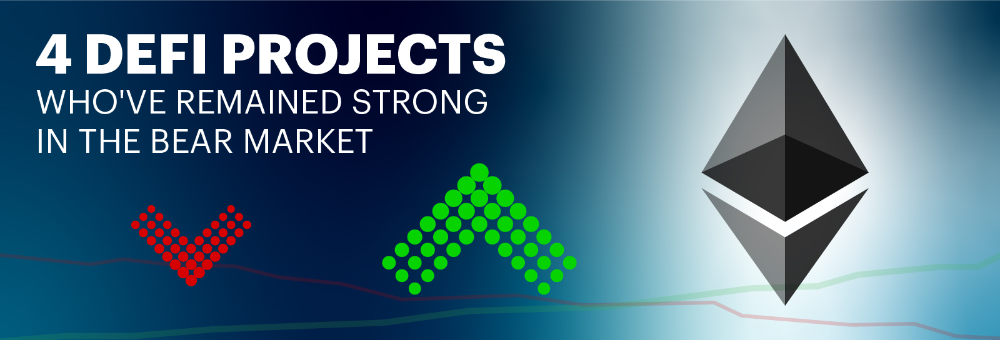

**By Kingsley Arinze**

Over the past few weeks, the crypto industry has faced many challenges that have caused some to question the principles upon which Web3 was founded.

The events surrounding the FTX exchange that continue to unfold have made the difference between DeFi and CeFi more clear than ever. In case you’ve not been following, FTX, which at its peak was the second-largest crypto exchange by volume, crashed on [November 8](https://twitter.com/SBF_FTX/status/1590012124864348160) owning up to [reports](https://www.coindesk.com/business/2022/11/02/divisions-in-sam-bankman-frieds-crypto-empire-blur-on-his-trading-titan-alamedas-balance-sheet) of being insolvent.

Although this is an unfortunate situation, it’s important that it doesn’t define nor represent the entire industry and that above all, we keep morale high to build and see another bull run yet again.

Here are 4 DeFi projects who remain strong to keep your hopes high and your heads down for building.

## Uniswap

[Uniswap](https://twitter.com/Uniswap) is a decentralized exchange that allows users to trade Ethereum (ERC20) tokens permissionlessly, without the need to interact with any centralized entity. The DeFi exchange was launched in November 2018 and has evolved through 3 versions. It currently has a monthly active user count of 3.6 million and a total value locked (TVL) of [3.32 billion](https://defillama.com/protocol/uniswap) at the time of writing.

Uniswap recently [launched UniswapV3](https://uniswap.org/blog/uniswap-v3), which introduces new features like concentrated liquidity and multiple fee tiers, making Uniswap efficient and flexible. 

As a testament, it has seen growth throughout this month as its daily new transacting wallets reached an all-time high of [55,550](https://twitter.com/Uniswap/status/1592282461211627520), signifying an increasing trust in code and maths, as opposed to institutions.

## Maker

[Maker](https://twitter.com/MakerDAO) is a peer-to-contract lending platform enabling over-collateralized loans by locking Ether in a smart contract and minting Dai, a stablecoin pegged to the US dollar. Its stability is achieved through a dynamic system of collateralized debt positions, autonomous feedback mechanisms, and incentives for external actors.

Elements of the Maker protocol include Dai stablecoin, Maker Collateral Vaults, Oracles, and Voting. MakerDAO governs the Maker Protocol by deciding on key parameters through the voting power of MKR holders.

It was launched in November 2017 and currently only runs on Ethereum, with a total value locked of  [6.46 billion](https://defillama.com/protocol/makerdao) at the time of writing. It currently holds the number 1 position for DeFi protocol with the most total value locked, with a dominance ratio of 11.85%.

## AAVE

[Aave](https://twitter.com/AaveAave) is a community-governed decentralized liquidity protocol that allows users to earn interest, borrow assets, and build applications on top of its liquidity. It is available across 7 networks: Ethereum, Avalanche, Optimism, and more.

Aave originally started as ETHLend in 2017, a platform that allowed users to make loan requests and offers, acting more as a community tool than an automated service. In 2020, it rebranded to Aave, migrating from the LEND token to Aave, and expanding its product offering to include loaning and borrowing, staking, and flash loans.

Aave currently has [6.43 billion](https://defillama.com/protocol/aave) in TVL across 7 networks and 13 markets. It has 1,308 daily active addresses and holds the number 2 position for DeFi platform with the most TVL.

Aave is also the founding team behind the creation of [LensProtocol](https://twitter.com/LensProtocol), a decentralized, open-source protocol that enables a new generation of social networks.

## Compound Finance

[Compound](https://twitter.com/compoundfinance) is another leading DeFi protocol in the ecosystem today. It is an open-source algorithmic cryptocurrency lending platform that allows users to earn “compound” interest on their cryptocurrency sitting idle in a wallet. It was founded in 2017 and only runs on Ethereum.

Compound has a total value locked of [2.45 billion](https://defillama.com/protocol/compound), including borrowed assets as of this writing. Recently, they announced the release of [compoundV3](https://www.coindesk.com/tech/2022/08/26/compounds-upgraded-defi-lending-platform-targets-security-scalability/), which reduces the number of supported tokens that can be borrowed and collateralized on the protocol.

CompoundV3 uses Chainlink as its exclusive price feed and simplifies governance smart contracts, enhancing the system’s security and scalability. 

## Conclusion

A common theme across these projects is they are all decentralized, with no centralized entity running the show from behind the scenes. These projects all rely on smart contracts available to the public to audit and analyze at any time. Decentralization allows each of these platforms to continue to hold and protect the trust of their users.
 
In light of the FTX downfall, it is important that we continue to build, sticking to the vision of web3, toward a more decentralized future where greater economic power rests in the hands of the individual. Remember, not your keys, not your crypto!

Although these projects listed in this post are a representation of what decentralization should be, hence their continuous growth and trust from their users, this post is NOT financial advice.
