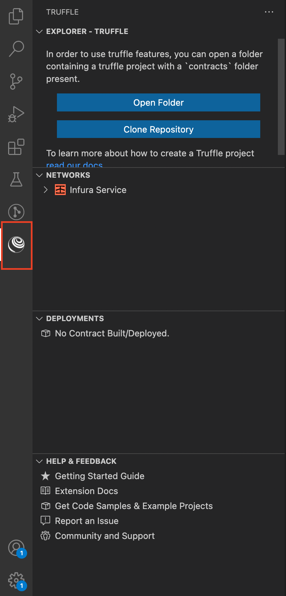
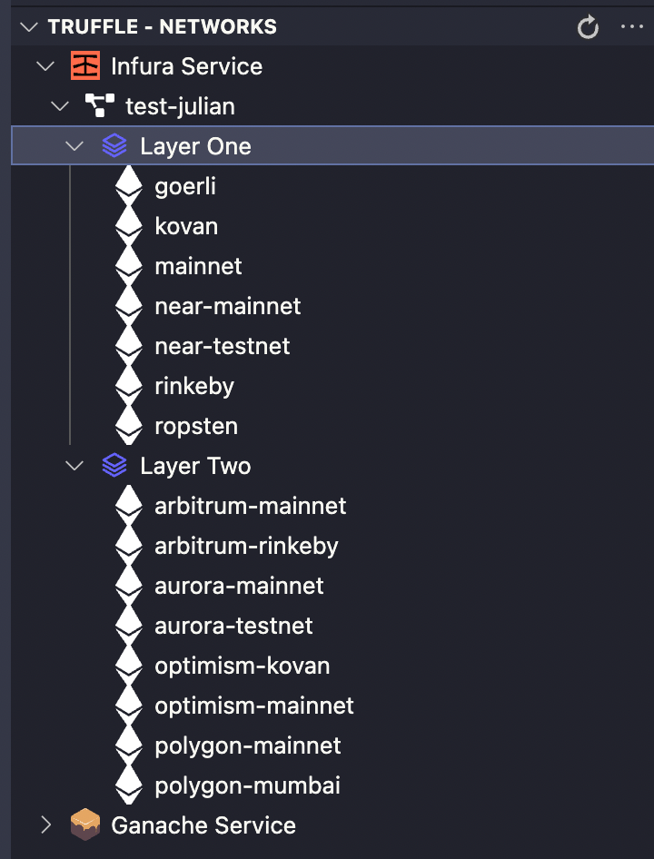

**By [Kingsley Arinze](https://twitter.com/heydamali)**

Earlier this year, we collaborated with Microsoft to [release the Truffle for VS Code extension](https://trufflesuite.com/blog/build-on-web3-with-truffle-vs-code-extension) which allowed newbies and experienced web3 developers to code, debug, and deploy their smart contracts without needing to leave VS Code.

This project which was originally started by Microsoft as the Blockchain Development Kit for Ethereum was transferred to the Truffle team for its maintenance through a [partnership program](https://consensys.net/blog/press-release/consensys-expands-blockchain-service-capabilities-on-microsoft-azure). Since then, we’ve seen some important integrations to existing developer resources and tools such as the integration of the Truffle debugger and Infura API.

Today, we’re excited to announce the release of the Truffle for VS Code **version 2.3**, which in addition to bug fixes, introduces some new features that further improves the user experience for dapp developers.

## Features and bug fixes in Truffle for VS Code version 2.3

Here are some of the features and bug fixes you should be aware of in this new version:
1. **Feature: New Truffle tree view**: This new version introduces a dedicated tree view on the right hand side of VS Code which gives extension users access to their contracts, deployments, and some helpful libraries and links as seen in the image below. Prior to these versions, access to these features were only available through the main VS Code explorer (SHIFT + CMD + P) which meant that they weren't easily accessible. Since this feature is still being improved on, some points worth noting are:
   - Not all of the features of the main explorer (SHIFT + CMD + P) are possible in the new explorer view. 
   - This new explorer view works on the basis of single repositories (not monorepos of multiple truffle projects) so we are going to be releasing fixes for that in the future.

2. **Feature: Ganache forked instance**: With this new feature, you can now choose to fork a network of your choice when starting Ganache through the VS Code extension. Just like you can with the command line, you can choose a specific block or the latest block to fork from directly in VS Code.

3. **Feature: Support for Layer 1 and Layer 2 networks through Infura**: Infura plans to update their service by offering a way to group our networks by Layer (i.e Layer 1 and Layer 2). This feature sets the foundation for supporting this feature in the Truffle for VS Code network views as seen in the image below. For now, we are waiting for the infura API release with the new response splitting networks into layer one and two.

4. **Bug fix: Build and deploy commands now work with mapping volumes on Windows 11**: This issue related to volume mapping was found on Windows 11 platforms where If a user opens a project in root (C:), the build and deploy commands both work fine. But, if the project is opened in a mapping volume, they get a `spawn C:\WINDOWS\system32\cmd.exe ENOENT` error. A fix was made and applied for windows platforms only.

5. **Bug fix: No more double checks for required apps**: The Truffle for VS Code extension relies on some third party services like [Ganache](https://trufflesuite.com/ganache), [Infura](https://infura.io?utm_source=truffle&utm_medium=referral&utm_campaign=2022_Jul_whats-new-on-the-truffle-for-vs-code-extension-version-2.3_content_content), and [Solidity plugin](https://docs.soliditylang.org/en/latest) to function properly therefore it does a background check upon installing the extension to verify whether these services are set up correctly for the user. In previous versions, there are times when the required apps check can sometimes happen twice internally causing an error that says the user has not got all the required apps installed correctly. This new version introduces a fix.

### Conclusion
Get started with the extension today by visiting the VS Code built-in marketplace and searching for “Truffle for VS Code”, or downloading it directly from the [VS Code online marketplace](https://marketplace.visualstudio.com/items?itemName=trufflesuite-csi.truffle-vscode). We appreciate any feedback you might have concerning the extension, so start a thread on [GitHub Discussions](https://github.com/orgs/trufflesuite/discussions/categories/vscode-extension)! As always, follow us on Twitter @trufflesuite to get the latest on all things Truffle!