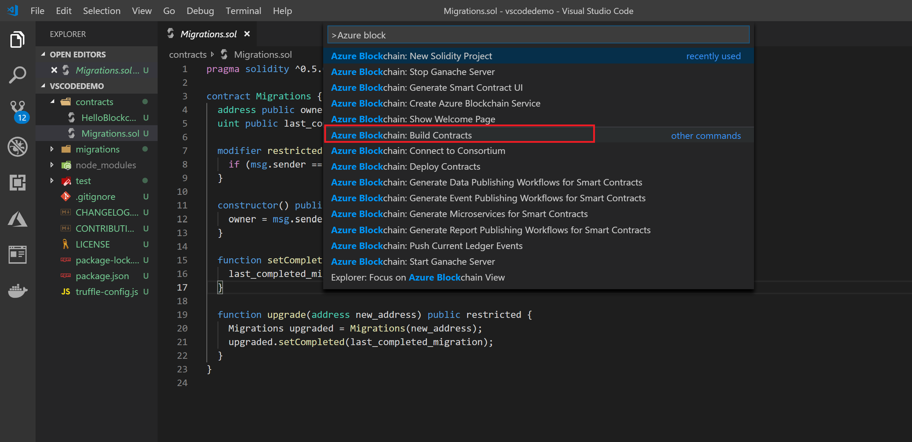
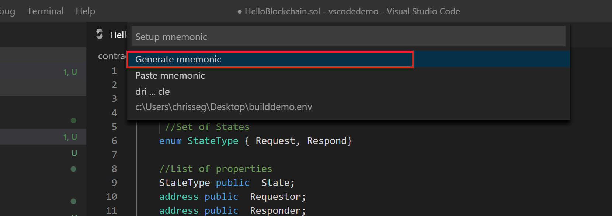
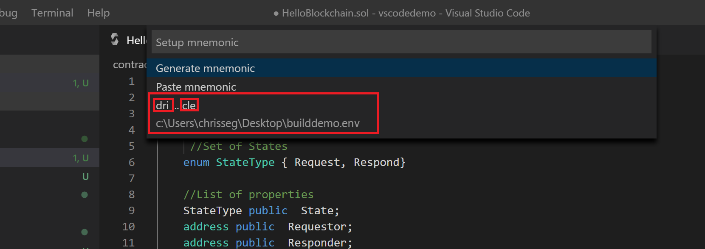
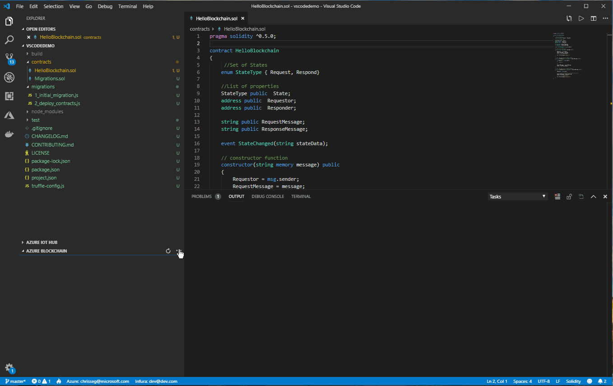
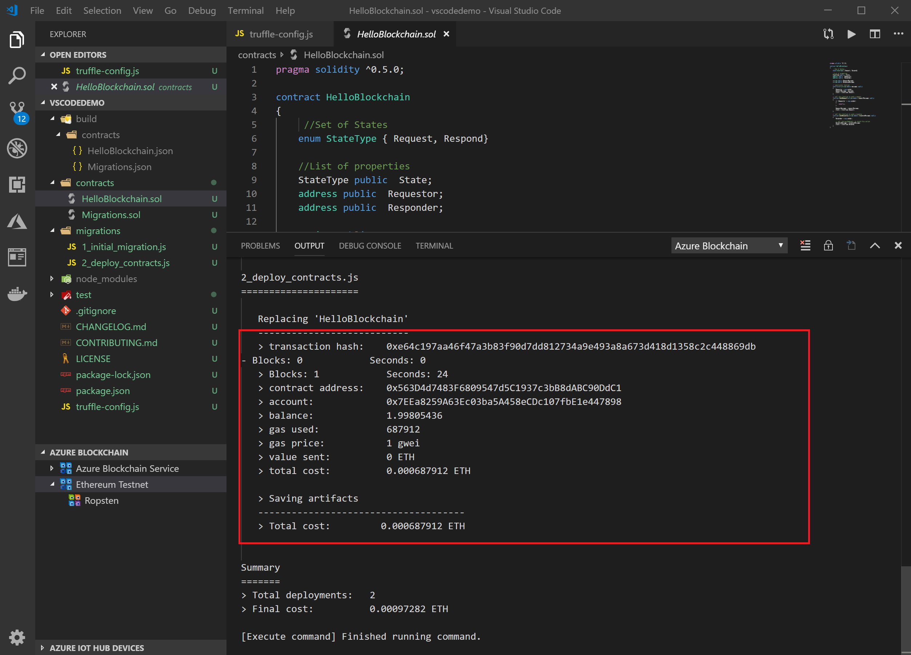

## Create, Build, and Deploy a new Solidity Smart Contact

The Trufflesuite for VSCode extension gives developers a quick way to quickly scaffold out a smart contract directory with a basic smart contract, Truffle directory structure and key files needed to deploy contracts locally (with Truffle Ganache), or to test/main-networks using leveraging accounts from [Infura](https://infura.io/).

This document details the smart contract flow from creating a brand new folder structure and sample project, through deploying that contract to local, or various test/main-networks. To jump to a specific section click the link below:

## Create a new Solidity Project

From the command palette, select `Truffle: New Solidity Project` . The extension will ask the developer to `Create Basic Project` or `Create Project from Truffle box`


1. `Create Basic Project` will scaffold out a simple Truffle compatible directory structure which includes a basic sample "HelloBlockchain.sol" contract, deployment (migration) files, basic contract test framework as well as basic files for GitHub integration. On completion `Create Basic Project` will build a directory for the developer, which is ready to build, and deploy to a network, with the structure shown below

   

## Import smart contract libraries from online sources

We would recommend you use the `npm` or `yarn` package managers to handle contract dependencies allowing you to have version control across your dependent contracts.

The OpenZepplin smart contracts library includes secure implementations of standards like ERC20 as well as useful functions like safe-math, Gas Station Network (GSN) support etc.

To use OpenZeppelin contract into your project follow these steps

1. Follow the setup instructions here: [install openzeppelin](https://https://docs.openzeppelin.com/contracts/4.x/#install)
2. Or on your command line in the root of the project run:

   ```shell
   npm install @openzeppelin/contracts
   ```

   or:

   ```shell
   yarn add @openzeppelin/contracts
   ```

## Build your smart contract

The basic contract is ready to be built and deployed, as is. You may also add/edit this contract to fit your needs.

Follow the instructions below to build your basic "HelloBlockchain" contract:

#### Option 1: Command Palette



#### Option 2: Right click on your contract.sol


`Note: The build contract action, from either palette or right-click shortcut will build all contracts in your directory automatically.`

In either option, the result of building your contract is to have the compiled contract code, application binary interface (ABI) and other common Solidity metadata created and added into the `./build` directory.

The build artifacts and directory structure leverage the [Truffle Suite](https://truffleframework.com/) of tools and are compatible with any Truffle automation or scripts that depend on that framework.

## Deploy your smart contract

Once you have built your contract, it's time to deploy it. With the Trufflesuite for VSCode, developers have the option of where to deploy their contract.

Deployment parameters are based on the Truffle [migrations](https://truffleframework.com/docs/truffle/getting-started/running-migrations) process which are defined, and managed, in the `truffle-config.js` file

### Local deployment

If a developer has not already connected to any other type of network, the default option will allow a developer to deploy their contract to an emulated Ethereum network. This local network is powered by [Truffle Ganache](https://truffleframework.com/docs/ganache/overview) ([ganache-cli](https://github.com/trufflesuite/ganache-cli/blob/master/README.md) specifically) and is enabled by default


Selecting the `development` network from the pick list will deploy your contracts to a local Ganache powered network. Deployment information, such as contract address, transaction hash and other deployment metadata are published in the Trufflesuite for VSCode output channel as shown below


It is worthwhile highlighting some of the key output parameters from the above local (Ganache) deployment:

- contract address: This is the address of the deployed "Helloworld" contract on the ledger. You may use this contract address to interact with your contract functions
- account: This is the account used to sign/send the contract. The account is autogenerated by the tool for you
- balance, gas, value and cost fields: Ganache is an Ethereum ledger emulator. As such, it also emulates the functions/parameters needed to send contracts to the public network. These functions/parameters include Eth and other parameters that apply to public networks.
  - `Please note: This is not real ETH, nor are there any monetary costs associated. These values are simply for simulation`
- Total deployments: note, in this example there were 2 deployments. Every deployment using the Truffle framework includes a "migrations" contract which is used to manage adding other contracts to the ledger. Thus the "Helloworld" contract deployment included the migrations contract, thus deployments == 2

#### Generate a new key

Developers may generate a new key automatically, though the extension. The extension will ask the developer to save the key in a file with a `.env` extension. Note the .gitignore file is already setup to exclude `.env` files from all Git/GitHub commits



#### Paste an existing mnemonic

Users who have previous keys, generated in tool like Metamask, can reuse those keys by simply pasting in the 12-word phrase. The extension will ask developers who have pasted in their mnemonic where they would like to store the file (as a `.env` file as described above)


Finally, for developers who may be testing with several existing keys stored in files on the development machine, the extension will show developers the first/last 3 characters of the 12-word phrase, and the location of the `.env` file on disk



#### Deploy to a test or Mainnet network via Infura

The Trufflesuite for VSCode extension supports developers who are building and deploying contracts to the public Ethereum network. To help simplify developer efforts, the Trufflesuite for VSCode supports connecting to these networks through a service such as [Infura](https://infura.io/)

To connect to and deploy a contract through Infura follow these steps.

1. From the command palette, select `Truffle: Sign into Infura account` from the menu

2. Sign into, or create your Infura account

3. Once signed in, you may connect to, or create an Infura project from the Blockchain Networks tab by clicking on the ellipses on the top right of the window

   

Once the Infura project is connected, the extension will updated your `truffle-config.js` to include the connection strings, for each destination. Deployment of a contract to Infura follows the same steps as deployment to local (Ganache) or to an Infura based network.

**Please note: The mnemonic used in this step must be the same one associated with your Ethereum user account. Please replace the 12-word mnemonic with a valid one and use caution when sharing this project with others to avoid exposing the mnemonic / account information.**

After setting up your `truffle-config.js` with the proper account information, deploying to a testnet, is the same process, you will see the results of your transaction in the Trufflesuite for VSCode output channel, shown below. This channel will provide you with key information such as transaction hash id and contract address on mainnet, or whichever test network you have deployed your contract to.


