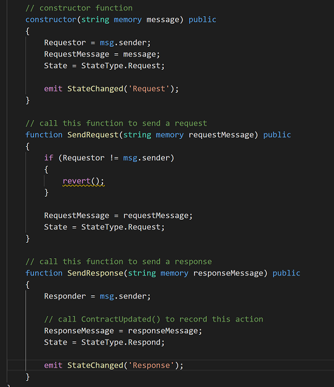
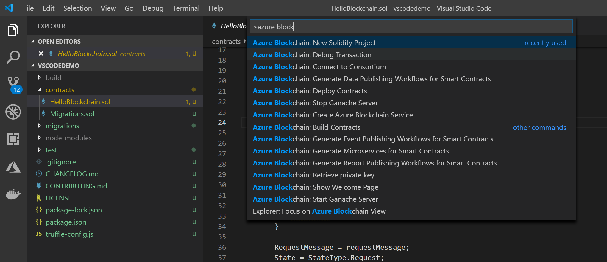
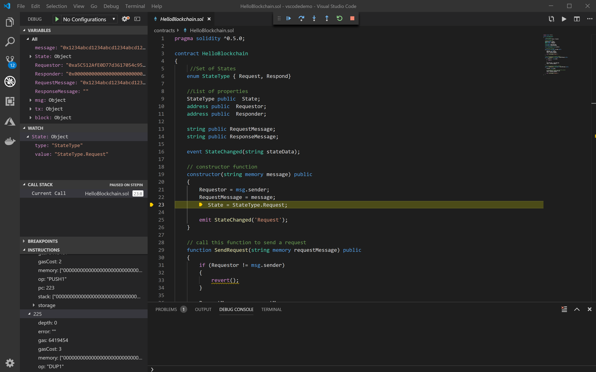
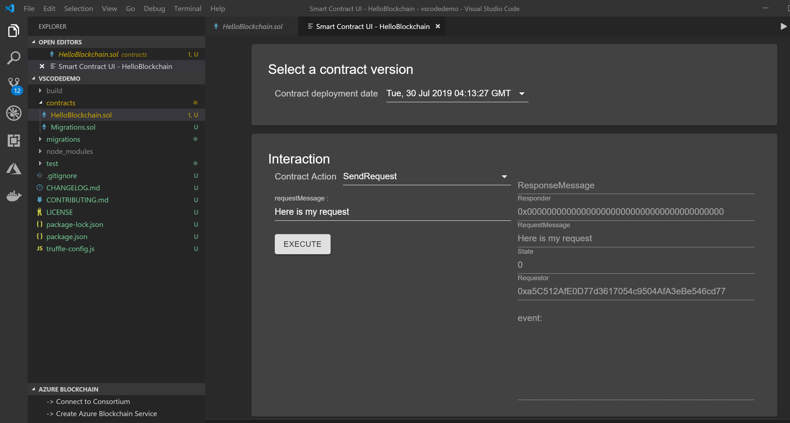
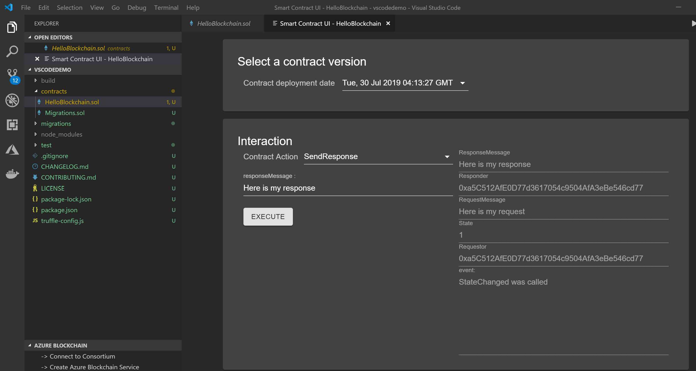

The Truffle for VSCode extension gives developers the ability to debug Solidity contracts in a typical VS Code debugging experience.

## Deploy your contract

### Local deployment

If a developer has not already connected to any other type of network, the default option will allow a developer to deploy their contract to an emulated Ethereum network. This local network is powered by [Truffle Ganache](https://truffleframework.com/docs/ganache/overview) ([ganache-cli](https://github.com/trufflesuite/ganache-cli/blob/master/README.md) specifically) and is enabled by default

## Debug your contract

To best illustrate how to use the debugger, we will walk through how to launch the debugger and "debug" a the`HelloBlockchain.sol` example contract that developers can [scaffold out, compile and deploy](./Contract-Management) through the extension.

The `HelloBlockchain.sol` contract contains 1 constructor and 2 functions as shown below:

When you initially deployed your contract, the constructor function was "executed" as the contract was added/deployed to the ledger. If you have not exercised the other functions prior to launching the debugger, those functions have not yet been acted on and the results added to the ledger. Thus on an initial deployment, only constructor functions are debuggable.

To debug the constructor after initial deployment, start the debugger by accessing the command palette (press `f1` or `ctrl+shift+p`) and choose `Debug Transaction` as shown below

After choosing `Debug Transaction`, you will be asked to pick which transaction you wish to hash. Since this is our first deployment, select the constructor transaction as shown below

After you select the transaction you wish to debug, the VS Code debugger will launch and you can use typical debugger functions such as watch windows, view the call stack, step in/out/over etc.

To debug the other functions (SendRequest and SendResponse in our HelloBlockchain.sol) you need to exercise those functions and debug those transactions much like the constructor. To exercise a function you can use the [UI interaction](./Interacting-with-your-Smart-Contract) capabilities of the Truffle for VSCode Developer extension

For example, let's generate the UI for our `HelloBlockchain.sol` contract and send messages to both the SendRequest and SendResponse functions

Now that we have exercised both our functions, when we launch the debugger this time we will see 2 additional transactions that we can debug. Launch the debugger using `f1 or ctrl+shift+p` and you should see something similar to this after selecting `Debug Transactions`

Selecting any of the new transactions will start the debugger as before and you may debug each transaction appropriately.
