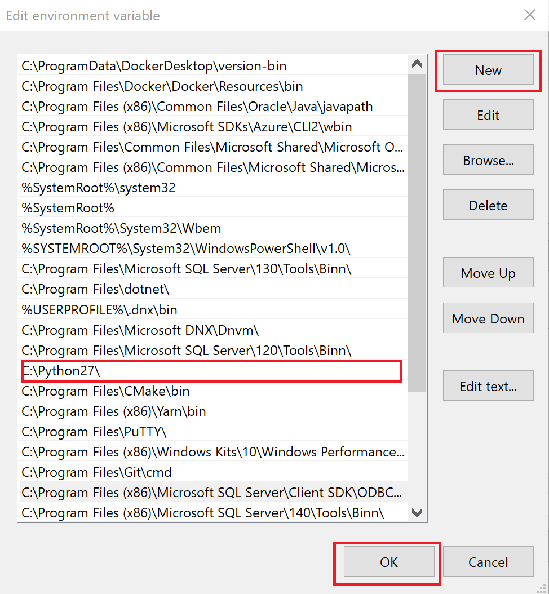
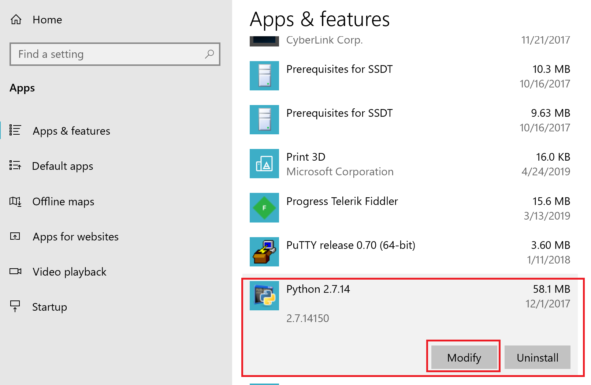

Frequently Asked Questions (FAQ)

## Questions

| [Q: I have installed Python, but still get the "missing" or "old version" notification](#Q:-i-installed-all-of-the-pre-requisite-software-but-I-still-get-the-missing-or-old-version-notification-for-python)                                                                |
| :--------------------------------------------------------------------------------------------------------------------------------------------------------------------------------------------------------------------------------------------------------------------------- |
| [Q: I am using a Truffle box or I have created my own project structure and would like to use the deployment options in the extension](#Q-i-am-using-a-truffle-box-or-i-have-created-my-own-project-structure-and-would-like-to-use-the-deployment-options-in-the-extension) |
| [Q: I have installed the extension and get prompted that Git client is not installed however it is installed](#Q-i-have-installed-the-extension-and-get-prompted-that-Git-client-is-not-installed-however-it-is-installed)                                                   |
| [Q: I am using the extension to create a new Solidity project and I am getting errors when creating the project](#Q-i-am-using-the-extension-to-create-a-new-solidity-project-and-i-am-getting-errors-when-creating-the-project)                                             |

- ### Q: I installed all of the pre-requisite software, but I still get the "missing" or "old version" notification for Python

- A: It's pretty likely that Python was installed without being added to your system PATH variable (the default installation mode of Python). To resolve this problem, you need to add your Python directory to the system path. You may do this by editing your PATH variable directly, or by reinstalling/fixing your Python installation as shown below

#### Adding your Python directory to your PATH variable directly

1. On Windows, you may edit your PATH variable by going to the Windows search bar and typing "env"
   
2. Once the System Properties panel launches, select `Environment Variables`
   
3. In the Environment Variables editor, select the System Variables, Path line and click Edit
   
   Finally, select New to add a new entry to your PATH, then type in`C:\Python27\` (or whichever directory you installed Python to), and select OK to save
   
4. To verify your changes, open up a new command prompt and type `python --version` as shown below
   

#### Reinstalling/fixing the Python installation

1. On Windows, you may edit your PATH variable by going to the Windows search bar and typing "add"
   
2. Scroll down to your Python installation and click `modify`
   
3. In the Python dialog box, click `Change Python`
   
4. Scroll down and select the red X next to `Add python.exe to Path`, then chose the `Will be installed on local hard drive` option.
   
5. Click Next
   
6. You can verify your changes by opening up a command prompt and typing `python --version` as shown below
   

- ### Q: I am using a Truffle box or I have created my own project structure and would like to use the deployment options in the extension

#### Adding the wallet provider to your existing project

1. Update your project to include the required package for the wallet. The underlying requirement is for [truffle-hdwallet-provider](https://github.com/trufflesuite/truffle-hdwallet-provider).
   If you have an existing package.json as part of your project, you can simply add the following to your dependencies section:

   ```json
   "truffle-hdwallet-provider": "1.0.10"
   ```

   If you do **NOT** have an existing package.json as part of your project, you can create one by running the following:

   ```shell
   npm init -y
   npm install truffle-hdwallet-provider@1.0.10 --save
   ```

2. Update the truffle configuration to include the use of the wallet provider and a native node package to access the file system. This should be added to top of the package.json file.

   ```javascript
   const HDWalletProvider = require('truffle-hdwallet-provider');
   const fs = require('fs');
   ```

3. To deploy locally to the managed ganache instance inside the extension, the wallet is **NOT** required. What is required to use the deployment is a network section for development. If this is not present in the package.json file, this can be added to the networks section.

   ```json
   development: {
     host: "127.0.0.1",     // Localhost (default: none)
     port: 8545,            // Standard Ethereum port (default: none)
     network_id: "*",       // Any network (default: none)
   }
   ```

4. To deploy to another target, no other configuration is needed. When selecting deploy contracts, the relevant network section will be added dynamnically to the truffle configuration.

5. To deploy to another target, that has been manually added to the truffle configuration, the provider will need to be added manually. Updated the truffle configuration, specific network section to use this provider:

   ```json
   provider: new HDWalletProvider(fs.readFileSync('<path to a file with a 12 work mnemonic', 'utf-8'), "<uri to rpc endpoint>")
   ```

`NOTE:` Some older truffle boxes use a truffle configuration file named truffle.js, versus the new one of using truffle-config.js. This is required for Windows based use of the Truffle suite.

- ### Q: I have installed the extension and get prompted that Git client is not installed however it is installed
  
#### The issue is caused by the fact that the git client is not added to the system path at installation. The fix is to update the path manually, details are below for Windows based machines.

1. On Windows, you may edit your PATH variable by going to the Windows search bar and typing "env"
   
2. Once the System Properties panel launches, select `Environment Variables`
   
3. In the Environment Variables editor, select the System Variables, Path line and click Edit
   
4. Finally, select New to add a new entry to your PATH, then type in `C:\Program Files\Git\bin\` (or whichever directory you installed Git to), and select OK to save.

- ### Q: I am using the extension to create a new solidity project and I am getting errors when creating the project

#### The issue is caused by a dependency that requires a C++ compiler to be installed. This can be remedied with a build tools installation. (NOTE: this solution pertains to Windows based operating systems only)

1. Open a Powershell shell under administrator rights, and run the following command:

```shell
npm install --global windows-build-tools
```

`NOTE: This installation will take a few minutes to install fully, so please be sure to wait to the command completely finishes.`
