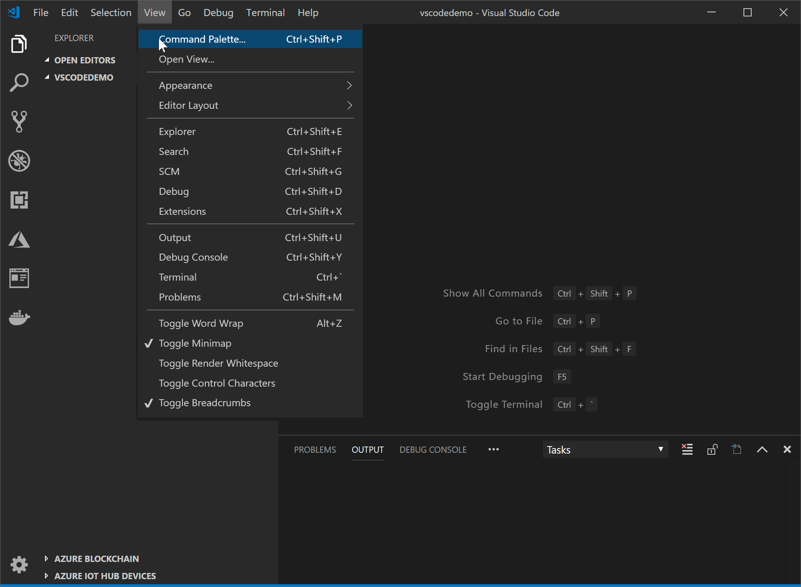
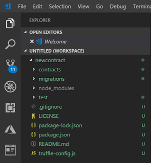
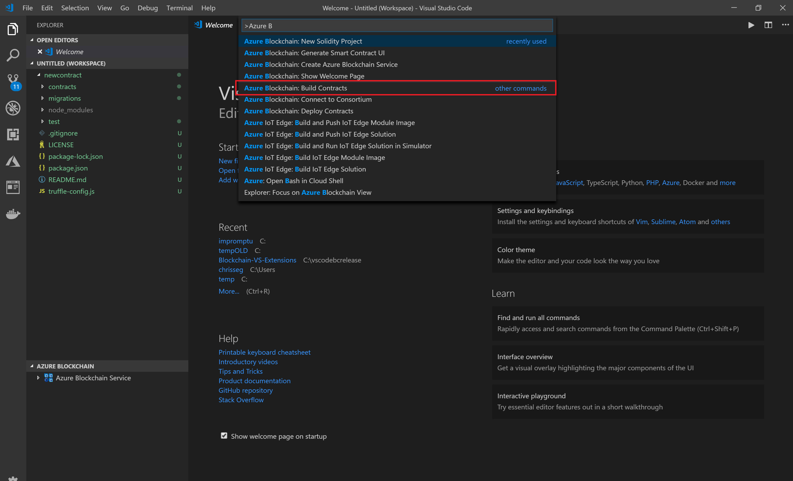
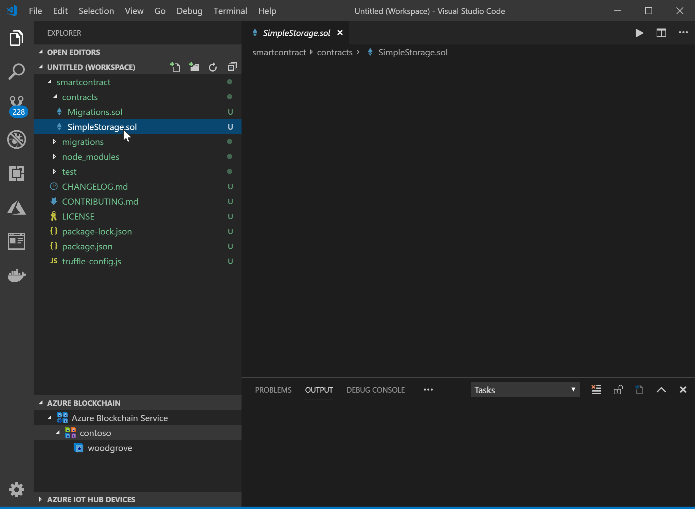
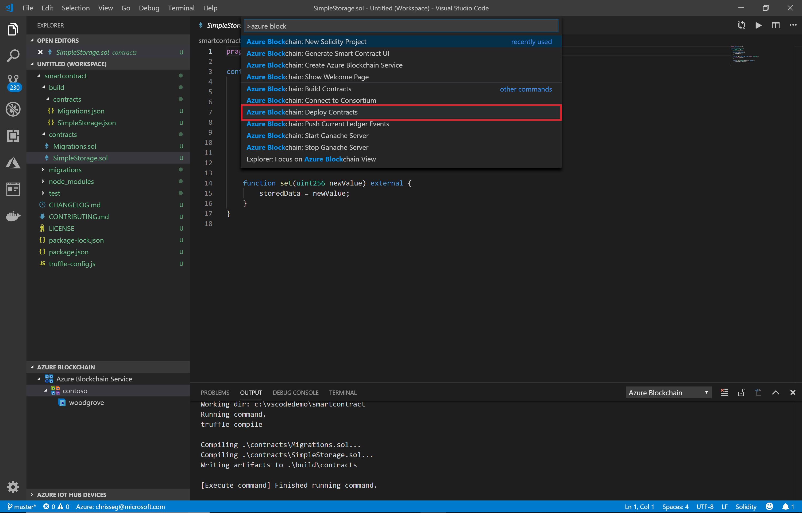
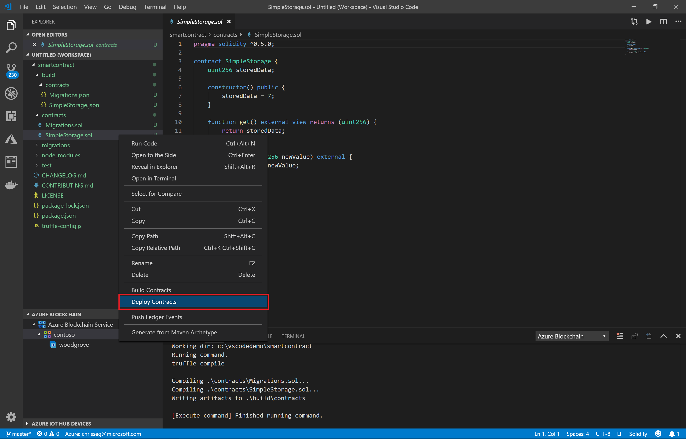

## Prerequisites

1. Install the Visual Studio Code extension [Truffle for VSCode](https://marketplace.visualstudio.com/items?itemName=trufflesuite-csi.truffle-vscode).
2. Install and dependencies like Node.js and Git as per the installation guide.

## Create a new Solidity Contract

The Truffle for VSCode for Ethereum leverages the [Truffle Suite](https://truffleframework.com/) of tools to help scaffold, build and deploy contracts.

Developers that are familiar with Truffle Suite may use the Truffle command line `e.g., Truffle Init` directly from the VS Code terminal.

For developers who are not familiar with Truffle, or prefer to use the Command Palette, the Truffle for VSCode can easily scaffold out a project directory using the following steps.

1. From the [Command Palette](./Command-Palette), type `Truffle: New Solidity Project`

   

2. Select an empty directory to scaffold out your project.

3. Choose a name for your contract.

4. Enter.

Once complete, your project directory should look like this:

## Build your Solidity Contract

Your newly scaffolded out directory includes a simple contract and all the necessary files to build and deploy a simple, working, contract to the Truffle. Use the following steps to build your contract.

### Option 1: Command Palette

1. From the [Command Palette](./Command-Palette), type `Truffle: Build Contracts`

   

### Option 2: Right click on your .sol file

1. Select your contract Solidity (.sol) file, right click and choose `Build Contracts`

   

## Deploy your smart contract to Truffle

Once compiled, you will have your contract, contract metadata (e.g., contract ABI, bytecode) available in the ./build directory. Once you have a local ganache instance running via the command palette or command line you will be ready to deploy. Once all these components are ready, deploying your new contract is simple and fast. Use the following steps to deploy your contract

### Option 1: Command Palette

1. From the [Command Palette](./Command-Palette), type `Truffle: Deploy Contracts`

   

### Option 2: Right click on your .sol file

1. Select your contract Solidity (.sol) file, right click and choose `Deploy Contracts`

Once activated through the command palette, or through the right click option on the .sol file, the deployment process gives users the option to deploy a contract to a local Ethereum emulation environment, or various public Ethereum endpoints such as a testnet, or mainnet. Details on this process are highlighted in the [Contract Management](./Contract-Management) section of this wiki.
